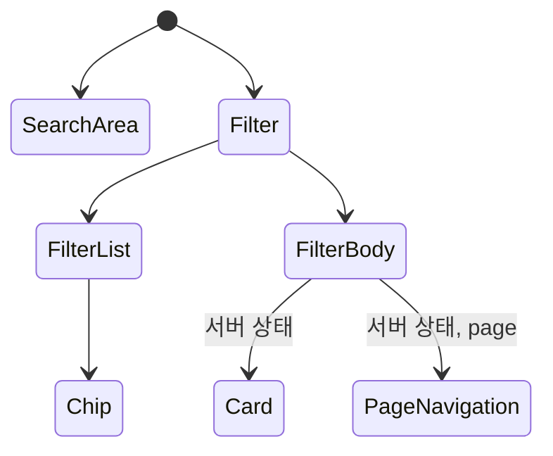

# elice-frontend-project

엘리스 커리어 부스트 위크

## 과제 해결 방식

### UI

- 가장 먼저 레이아웃 배치 부터 시작해 간단한 로컬 상태는 UI를 구현하면서 같이 구현했습니다.
- 이하는 컴포넌트 구조입니다.

### 트러블 슈팅
#### 1. 필터 부분의 상태와 쿼리 파라미터 연결
- 먼저 chip의 배치는 FILTER_DATA라는 자료구조를 이용해서 1줄씩 표시하고 각 chip의 번호는 배열의 인덱스를 그대로 활용했습니다.
- 클릭한 chip에 해당하는 쿼리파라미터를 설정해주기 위해 queryMap이라는 객체를 이용해 chip과 쿼리 파라미터를 연결시켰습니다.
- 처음에는 chip 내부에서 쿼리파라미터 객체를 설정했었지만 로직이 복잡해져 커스텀 훅으로 변경했습니다.
- 새로고침이 되어도 쿼리 파라미터는 유지가 됐지만 state가 유지가 되질 않아 쿼리파라미터를 읽고 state를 다시 set 해주는 방식으로 구현했습니다.

#### 2. Pagination
- 처음에는 page state를 해당 컴포넌트에서 관리하다 해당 페이지에 맞게 offset를 변경해 api요청이 필요한걸 알게 되었고 이를 위해 api요청 부분에서(바로 상단 컴포넌트 FilterBody) state를 prop로 내려주는 방식으로 변경했습니다.
- state를 사용하기 위해 api요청을 하는 컴포넌트(FilterBody)를 클라이언트 컴포넌트로 변경시켰습니다.
- 변경된 page에 맞게 offset을 변경시켜 api를 다시 요청하는 형식으로 구현했습니다.

#### 3. middleware API
- cors를 해결하기 위해 엘리스의 production api 요청은 미들웨어에서 해서 필요한 데이터만 선택에 클라이언트에게 보냅니다.
- 클라이언트에서 미들웨어로 api를 요청할 시, 쿼리파라미터로 offset, 필터 옵션을 보냅니다.
- 필터 옵션에 맞게 filter_conditions를 생성해 엘리스 api에 요청합니다.
- filter_conditions는 엘리스 홈페이지에서 key, value를 하나하나 확인해서 매칭시켜줬습니다.